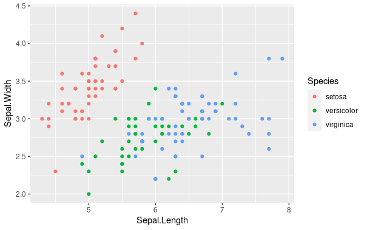
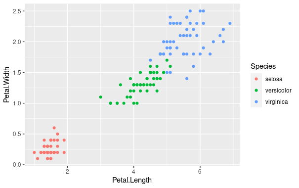
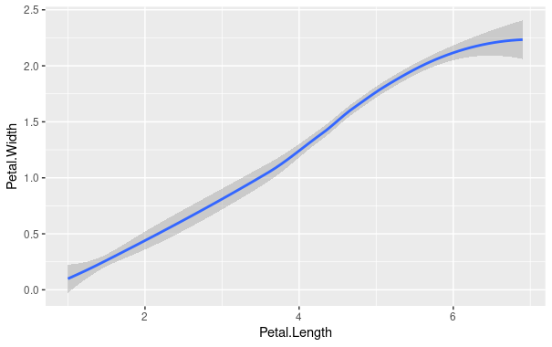
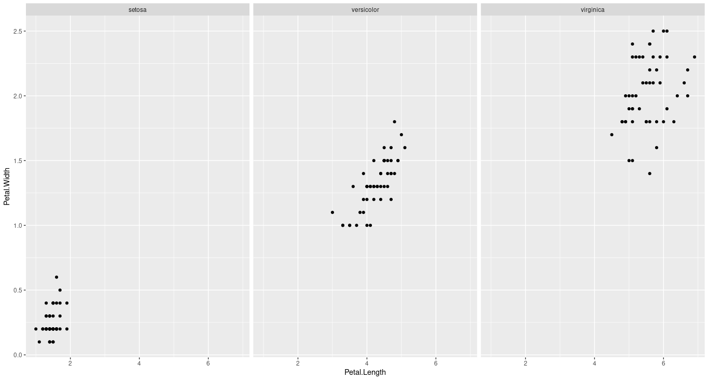

# 2

```
> library(ggplot2)
```

```
> qplot(data = iris, x = Sepal.Length, y = Sepal.Width, geom = "point", color = Species)
```



```
> ggplot(data = iris) +
+ geom_point(mapping = aes(x=Petal.Length, y=Petal.Width, color=Species))
```



```
> qplot(data = iris, x = Petal.Length, y = Petal.Width, geom = "smooth")
`geom_smooth()` using method = 'loess' and formula 'y ~ x'
```



```
> ggplot(data = iris) +
+ geom_point(mapping = aes(x=Petal.Length, y=Petal.Width)) +
+ facet_wrap(~ Species, nrow = 1)
```


